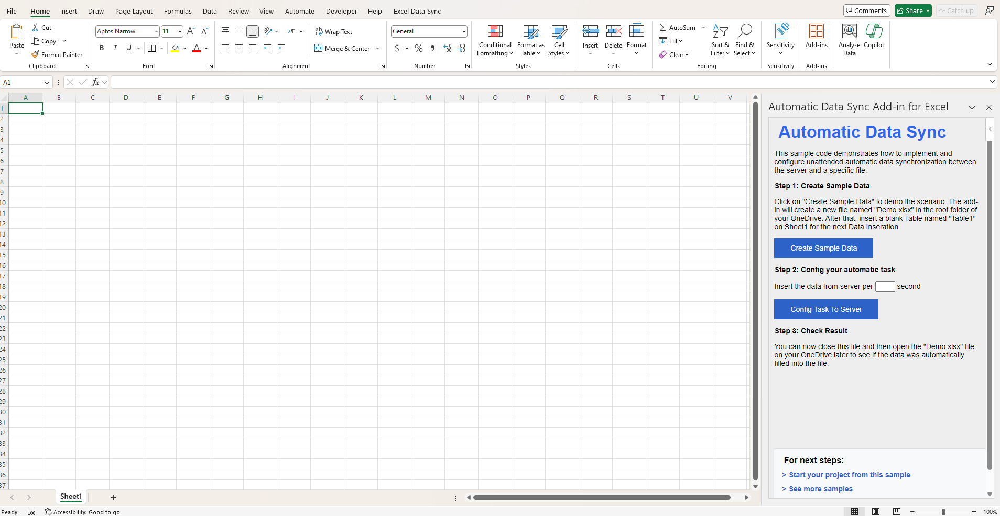
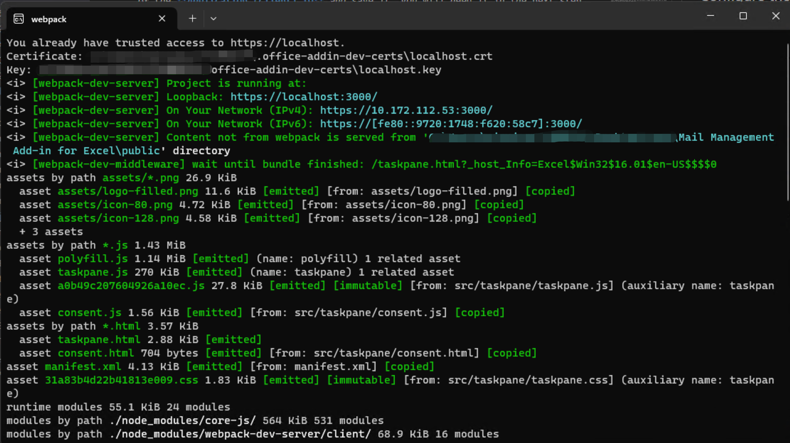
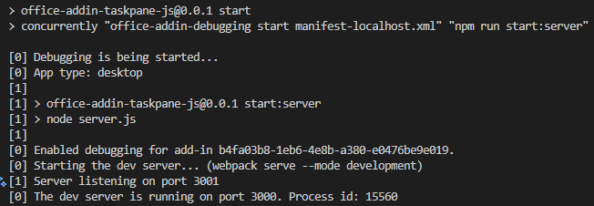
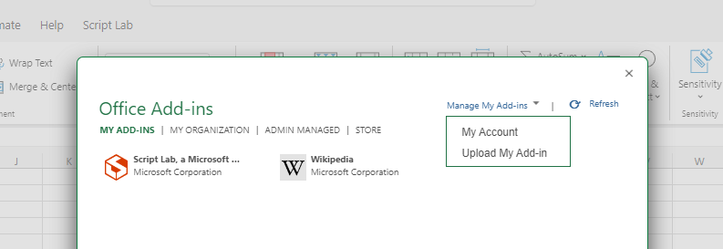

# Microsoft Excel Automatic Data Sync Sample Add-in

[](https://github.com/microsoftgraph/msgraph-training-office-addin/actions/workflows/node.js.yml) 

This sample demonstrates how to use the Microsoft Graph JavaScript SDK to implement and configure unattended automatic data synchronization between the server and a specific file.

## How the sample add-in works

### Features

- Create Sample Data, including Create a file named "Demo.xlsx" in your root folder on OneDrive and then insert a Table into it.
- Config your automatic task. Insert the data from Server according to the user setting.
- Close the file and then open the "Demo.xlsx" file later to see if the data was automatically filled into the file.



## Build, run and debug the sample code

### Prerequisites

To run the completed project in this folder, you need the following:

- [Node.js](https://nodejs.org) installed on your development machine. (**Note:** This tutorial was written with Node version 16.14.0. The steps in this guide may work with other versions, but that has not been tested.)
- Either a personal Microsoft account, or a Microsoft work or school account. You can [sign up for the Microsoft 365 Developer Program](https://developer.microsoft.com/microsoft-365/dev-program) to get a free Microsoft 365 subscription.

### Manually run on your local machine

#### 1. Resiger to get an application ID

If you haven't registered a web application with the Azure Active Directory admin center, please follow the steps below:

- Log into [Microsoft Entra admin center](https://aad.portal.azure.com) using a personal or business Microsoft account.
- In the navigation, select **Identity > Applications > App registrations**.
- Choose **New registration**. On the **App registrations** page, configure the values as follows: - Set **Name** to `Office Add-in Graph Tutorial`. - Set **Supported account types** to **Accounts in any organizational directory and personal Microsoft accounts**. - Under **Redirect URI**, set the first drop-down to `Single-page application (SPA)` and set the value to `
https://localhost:3000/consent.html`.
- Click **Register** and copy the value of the **Application (client) ID**.

#### 2. Configure the API Permission of the Application

- In the **Office Add-in Graph Tutorial** detailed page, select **Manage > API permissions**. Then select **Add a permission**.
- Select **Microsoft Graph**, then **Delegated permissions**.
- Select the following permissions, then select **Add permissions**.
  - **Files.ReadWrite** - this will allow the app to read and write to the user's files.
  - **Sites.ReadWrite.All** - this will allow the app to have the full permission to user's OneDrive.
- Click **Grant admin consent for Contoso**.

#### 3. In Visual Studio Code: edit the `taskpane.js` file and replace `YOUR_APP_ID_HERE` with the **Application Id** you got from the App Registration Portal.

#### 4. Run the following commands one by one in your CLI to start the sample add-in on desktop.

```
npm install  &&  npm run start
```

### Expected result

A webpack server will be hosted on https://localhost:3000/, as the CLI shows:



A local server will be hosted on https://localhost:3001/, as the log shows:



An Excel desktop application will be auto-launched and the Automatic Data Sync Addin will be auto-run on the right taskpane area. The sideload steps has been integrated into the process, eliminating the need for manual intervention.


Please follow the steps below:

1. Create Sample Data, including Create a file named "Demo.xlsx" in your root folder on OneDrive and then insert a Table into it.

2. Config your automatic task. Insert the data from Server according to the user setting.

3. Close the file and then open the "Demo.xlsx" file later to see if the data was automatically filled into the file.

### Sideload the sample add-in on Excel Online

The previous steps show you how to run our sample on Desktop. As for the Excel Online, please follow the following steps to sideload the manifest.xml file on web.

1.  **Keep the webpack server on** to host your sample add-in.
1.  Open [Office on the web](https://office.live.com/).
1.  Choose **Excel**, and then open a new document.
1.  On the **Home** tab, in the **Add-ins** section, choose **Add-ins** and click **More Add-ins** on the lower-right corner to open Add-in Store Page.
1.  On the **Office Add-ins** dialog, select the **MY ADD-INS** tab, choose **Manage My Add-ins**, and then **Upload My Add-in**.

    

1.  Browse to the localhost add-in manifest file(manifest-localhost.xml), and then select **Upload**.

1.  Verify that the add-in loaded successfully.

## Additional resources

You may explore additional resources at the following links:

- More samples: [Office Add-ins code samples](https://github.com/OfficeDev/Office-Add-in-samples)
- Office add-ins documentation: [Office Add-ins documentation](https://learn.microsoft.com/en-us/office/dev/add-ins/)

## Feedback

Did you experience any problems with the sample? [Create an issue](https://github.com/OfficeDev/Word-Scenario-based-Add-in-Samples/issues/new) and we'll help you out.

Let us know your experience using our sample code for Office add-in development: [Sample survey](https://aka.ms/OfficeDevSampleSurvey).

## Copyright

Copyright (c) 2024 Microsoft Corporation. All rights reserved.
This project has adopted the [Microsoft Open Source Code of Conduct](https://opensource.microsoft.com/codeofconduct/). For more information, see the [Code of Conduct FAQ](https://opensource.microsoft.com/codeofconduct/faq/) or contact [opencode@microsoft.com](mailto:opencode@microsoft.com) with any additional questions or comments.
<br>**Note**: The taskpane.html file contains an image URL that tracks diagnostic data for this sample add-in. Please remove the image tag if you reuse this sample in your own code project.


## Disclaimer

**THIS CODE IS PROVIDED _AS IS_ WITHOUT WARRANTY OF ANY KIND, EITHER EXPRESS OR IMPLIED, INCLUDING ANY IMPLIED WARRANTIES OF FITNESS FOR A PARTICULAR PURPOSE, MERCHANTABILITY, OR NON-INFRINGEMENT.**
