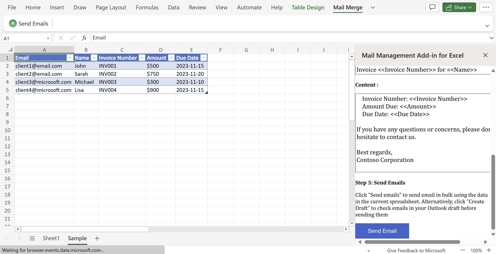
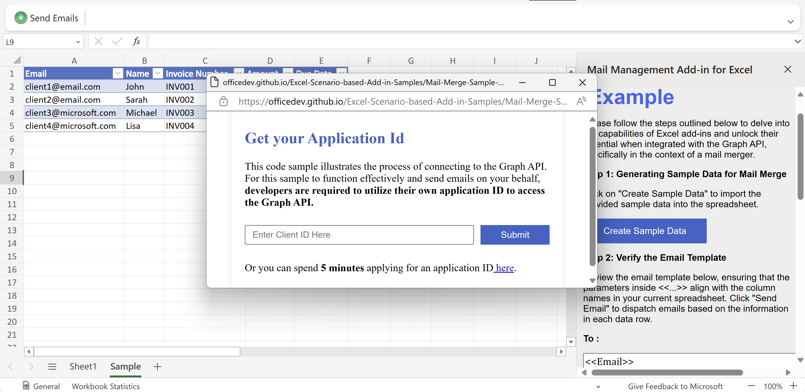

# Microsoft Excel Mail Merge Sample Office Add-in

[](https://github.com/microsoftgraph/msgraph-training-office-addin/actions/workflows/node.js.yml) 

This sample demonstrates how to use the Microsoft Graph JavaScript SDK to send emails in Excel from Office Add-ins.

### Features
Create Sample Data, including valid email address (required) and other information.


Verify Template and Data, the To Line must contain the column name of the email address


Send Email, which will pop up a dialog to get the consent of Microsoft Graph. After sign-in, the email will be send out


## Build, run and debug the sample code
### Prerequisites

To run the completed project in this folder, you need the following:
- [Node.js](https://nodejs.org) installed on your development machine. (**Note:** This tutorial was written with Node version 16.14.0. The steps in this guide may work with other versions, but that has not been tested.)
- Either a personal Microsoft account with a mailbox on Outlook.com, or a Microsoft work or school account. You can [sign up for the Microsoft 365 Developer Program](https://developer.microsoft.com/microsoft-365/dev-program) to get a free Microsoft 365 subscription.
- You need to register a web application with the Azure Active Directory admin center to send out emails.<br>

    > 1. Open a browser and navigate to the [Microsoft Entra admin center](https://aad.portal.azure.com). Login using a **personal account** (aka: Microsoft Account) or **Work or School Account**.
    > 1. Select **Identity** in the left-hand navigation, then select **App registrations** under **Applications**.
    > 1. Select **New registration**. On the **App registrations** page, set the values as follows.
        - Set **Name** to `Office Add-in Graph Tutorial`.
        - Set **Supported account types** to **Accounts in any organizational directory and personal Microsoft accounts**.
        - Under **Redirect URI**, set the first drop-down to `Single-page application (SPA)` and set the value to `https://localhost:3000/consent.html`.
    > 1. Select **Register**. On the **Office Add-in Graph Tutorial** page, copy the value of the **Application (client) ID** and save it, you will need it in the next step.
    > **Note**: This step needs to be **performed only once** by add-in developer, aiming to integrate your app with the Microsoft identity platform and establishing the information that it uses to get tokens. After successful registration and add-in published, **customer can use it directly**, do not need to register again. 

### Configure the sample
1. Edit the `taskpane.js` file and make the following changes.
    - Replace `YOUR_APP_ID_HERE` with the **Application Id** you got from the App Registration Portal.
1. In your command-line interface (CLI), navigate to this directory and run the following command to install requirements.

    ```
    npm install
    ```

### Run the sample on Windows and Mac

Run the following command in your CLI to start the application.
```
npm run build
npm start
```

### Expected result

A webpack server will be hosted on https://localhost:3000/, as the CLI shows:


An Excel desktop application will be auto-launched and the Mail Merge Addin will be auto-run on the right taskpane area. The sideload steps has been integrated into the process, eliminating the need for manual intervention.


Please follow the steps below:

1. Create Sample Data, including valid email address (required) and other information.

2. Verify Template and Data, the To Line must contain the column name of the email address.

3. Send Email, which will pop up a dialog to get the consent of Microsoft Graph. After sign-in, the email will be send out.

    

### Sideload the sample add-in on Excel Online

The previous steps show you how to run our sample on Desktop. As for the Excel Online, please follow the following steps to sideload the manifest.xml file on web.

1.  **Keep the webpack server on** to host your sample add-in.
1.  Open [Office on the web](https://office.live.com/).
1.  Choose **Excel**, and then open a new document.
1.  On the **Home** tab, in the **Add-ins** section, choose **Add-ins** and click **More Add-ins** on the lower-right corner to open Add-in Store Page.
1.  On the **Office Add-ins** dialog, select the **MY ADD-INS** tab, choose **Manage My Add-ins**, and then **Upload My Add-in**.

    

1.  Browse to the localhost add-in manifest file(manifest-localhost.xml), and then select **Upload**.

    

1.  Verify that the add-in loaded successfully. 

## Additional resources
You may explore additional resources at the following links:
- More samples: [Office Add-ins code samples](https://github.com/OfficeDev/Office-Add-in-samples)
- Office add-ins documentation: [Office Add-ins documentation](https://learn.microsoft.com/en-us/office/dev/add-ins/)

## Feedback
Did you experience any problems with the sample? [Create an issue]( https://github.com/OfficeDev/Word-Scenario-based-Add-in-Samples/issues/new) and we'll help you out.

## Copyright
Copyright (c) 2021 Microsoft Corporation. All rights reserved.
This project has adopted the [Microsoft Open Source Code of Conduct](https://opensource.microsoft.com/codeofconduct/). For more information, see the [Code of Conduct FAQ](https://opensource.microsoft.com/codeofconduct/faq/) or contact [opencode@microsoft.com](mailto:opencode@microsoft.com) with any additional questions or comments.
<br>**Note**: The taskpane.html file contains an image URL that tracks diagnostic data for this sample add-in. Please remove the image tag if you reuse this sample in your own code project.


## Disclaimer
**THIS CODE IS PROVIDED *AS IS* WITHOUT WARRANTY OF ANY KIND, EITHER EXPRESS OR IMPLIED, INCLUDING ANY IMPLIED WARRANTIES OF FITNESS FOR A PARTICULAR PURPOSE, MERCHANTABILITY, OR NON-INFRINGEMENT.**
